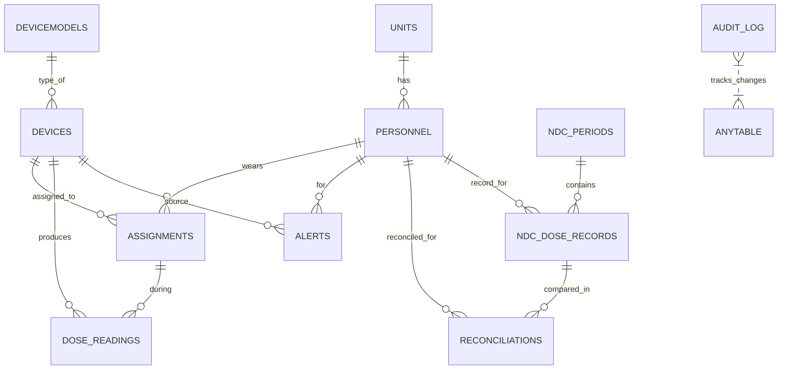
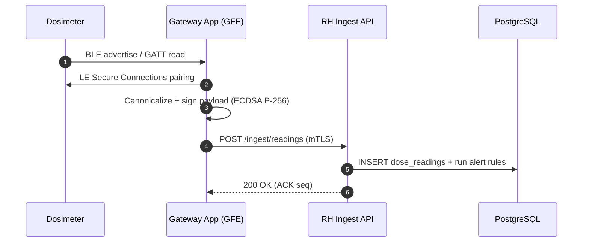

# Navy Radiation Health (RadHealth) Module — Concept & ERD (Bluetooth Dosimeters)

**Author:** ChatGPT (Starter document)  
**Scope:** Concept of operations, constraints, and high‑level data model for a Navy Radiation Health module that ingests near‑real‑time dose data from Bluetooth‑enabled personal dosimeters and reconciles against dose‑of‑record.

---

## 1) Mission Fit & Constraints

- **Operational vs. Dose of Record:** Treat BLE data as *operational awareness*. The **dose of record** remains the accredited processor’s result (e.g., Naval Dosimetry Center); reconcile monthly/quarterly.  
- **Policy Compliance:** Align to NAVMED Radiation Health policies (e.g., NAVMED 6470 series), maintain audit trails, and support required forms/exports.  
- **Wireless Posture:** Bluetooth in Navy spaces is tightly controlled. Support site‑configurable RF modes: **NORMAL** (BLE on), **CONTROLLED** (BLE off; wired/NFC cradle), **NO_RF** (queue offline).  
- **Security:** Enforce DISA STIG baselines on endpoints/servers, FIPS‑validated crypto, NIAP profiles for mobile, CAC/Derived‑CAC auth, mTLS to backend, and tamper‑evident logs.  
- **Vendor‑Agnostic:** Abstract a “Dosimeter Adapter” layer so you can plug in different vendors (GATT/SDK variations) without changing core logic.

---

## 2) Reference Architecture (Ashore & Afloat)

**Edge (wearer) → Gateway → RH Server → Enterprise**

1. **Dosimeter (BLE):** Secure pairing; queue data when RF is disabled.  
2. **Gateway (GFE mobile or rugged hub):** Reads GATT/SDK, timestamps, signs canonical payloads (e.g., ECDSA P‑256), caches offline, and posts via **mTLS**.  
3. **RH Server (on‑prem/shipboard):** Validates signature, stores to PostgreSQL, runs alerting, enforces RLS, and exposes APIs.  
4. **Enterprise/EHR/OMDS:** Periodic reconciliation with dose‑of‑record; export via **FHIR** (Observation/Device/Patient) or **HL7 v2 ORU**; support NAVMED forms.

---

## 3) ERD (High Level)



**Entities (purpose):**
- **UNITS, PERSONNEL** — force structure; RLS scoping via unit access.  
- **DEVICEMODELS, DEVICES** — hardware inventory, firmware/calibration, RF policy.  
- **ASSIGNMENTS** — time‑bounded wearer↔device linkage (join key for analytics).  
- **DOSE_READINGS** — time series (partitioned monthly) with raw vendor JSON and signed payload.  
- **ALERTS** — rate spikes, cumulative thresholds, missed reads, tamper, low battery.  
- **NDC_PERIODS, NDC_DOSE_RECORDS** — authoritative dose‑of‑record imports.  
- **RECONCILIATIONS** — variance between operational sums and NDC results.  
- **AUDIT_LOG** — change history for accreditation and investigations.

---

## 4) Minimal PostgreSQL Shape (Starter Columns)

> Full production DDL should include partitioning, RLS, RBAC, and auditing triggers; see companion schema for implementation.

- **units**(id, uic, name, parent_uic, created_at)  
- **personnel**(id, edipi, rank_rate, lname, fname, unit_id, active, created_at)  
- **devicemodels**(id, vendor, model, firmware_min, hp10_support, hp007_support, gatt_service_uuid, gatt_char_uuid)  
- **devices**(id, model_id, serial, ble_mac, firmware, calib_due, rf_policy, created_at, retired_at)  
- **assignments**(id, device_id, personnel_id, start_ts, end_ts)  
- **dose_readings**(id, device_id, measured_ts, gateway_ts, hp10_mSv, hp007_mSv, rate_uSv_h, battery_pct, raw_json, payload_sig, sig_alg, gateway_id)  
- **alerts**(id, created_ts, type, severity, threshold, value, device_id, personnel_id, measured_ts, ack_by, ack_ts, details)  
- **ndc_periods**(id, period_start, period_end, ndc_source_doc)  
- **ndc_dose_records**(id, period_id, personnel_id, hp10_mSv, hp007_mSv, notes)  
- **reconciliations**(id, period_id, personnel_id, op_hp10_mSv, ndc_hp10_mSv, variance_mSv, created_ts, details)  
- **audit_log**(id, ts, actor, action, obj_schema, obj_table, obj_id, before, after)

---

## 5) BLE Gateway Flow (Example)

### Sequence



### Gateway Payload (JSON)
```json
{
  "device_serial": "VUE-1234567",
  "device_model": "Instadose VUE",
  "measured_ts": "2025-08-20T12:01:22Z",
  "hp10_mSv": 0.012345,
  "hp007_mSv": 0.003210,
  "rate_uSv_h": 0.50,
  "battery_pct": 81.5,
  "raw": { "seq": 4172, "tempC": 29.2, "lifetime_mSv": 4.212 },
  "gateway_id": "GFE-PIXEL6A-42",
  "sig_alg": "ECDSA_P256_SHA256",
  "payload_sig_b64": "MEUCIF...=="
}
```

### RF Policy Modes

- **NORMAL:** BLE allowed; poll and upload immediately.  
- **CONTROLLED:** BLE disabled; sync via cradle/NFC; queue offline.  
- **NO_RF:** No RF activity; upload only over wired LAN; refuse pairing.

---

## 6) Reconciliation Logic (Concept)

1. Sum operational **Hp(10)** per wearer for a defined period using `assignments` to join readings to personnel over time.  
2. Import NDC dose‑of‑record for the same period.  
3. Compute `variance_mSv = op_hp10_mSv − ndc_hp10_mSv`; flag significant differences for review.  
4. Persist comparisons in **reconciliations** and render a variance report for the Radiation Health Officer.

---

## 7) Risks & Mitigations (Abbrev.)

- **Wireless restrictions (HERO/EMCON/classified):** Provide RF policy modes + cradle/NFC; log state transitions.  
- **Vendor lock‑in:** Use an adapter layer to normalize GATT/SDK differences.  
- **Clock trust:** Prefer device time only if attested; else gateway server time; include monotonic sequence in `raw_json`.  
- **Tamper/data integrity:** Sign canonical payloads in the secure keystore; validate at ingest; store signature.  
- **Privacy/RLS:** Scope reads and reports to unit access; enable row‑level security and thorough audit logging.

---

## 8) Quick‑Start Next Steps

1. Stand up PostgreSQL schema and roles; enable partitioning for `dose_readings`.  
2. Deploy minimal ingest API (.NET 8) behind an mTLS‑terminating reverse proxy on Windows Server 2022.  
3. Build a pilot Android/iOS gateway reading a mock GATT characteristic, posting signed payloads.  
4. Import one period of dose‑of‑record and run a reconciliation to validate the workflow.

---

*This document is a starting point; plug in your site policies, vendor SDK specifics, and accreditation artifacts as you harden toward production.*
